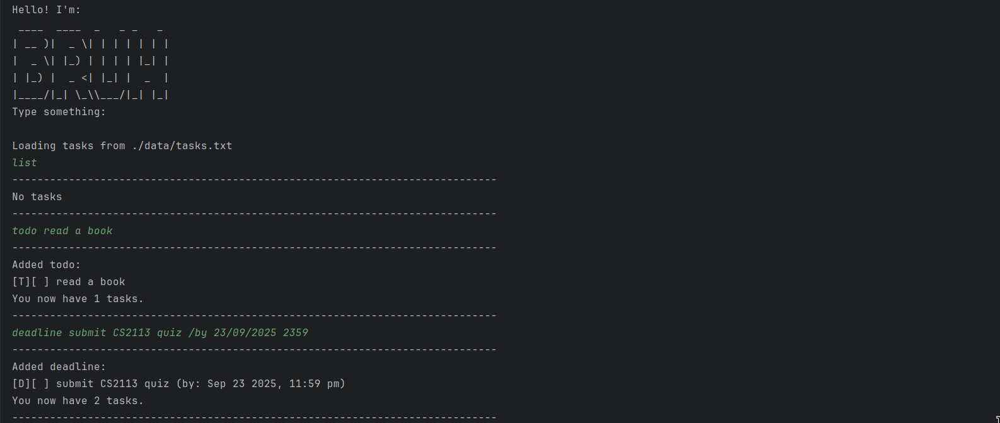

# Bruh User Guide



Bruh is a friendly task management chatbot that helps you track your todos, deadlines, and events.
You can quickly add tasks, mark them as done, find them by keyword or date, and delete them.

## Adding Todos

Use the `todo` command to add a simple task without a date.

**Example:**

```
todo Buy groceries
```

**Expected outcome:**

```
Added todo: 
[T][ ] Buy groceries
You now have 1 tasks.
```

---

## Adding Deadlines

Use the `deadline` command to add a task that must be done by a specific date and time.

**Example:**

```
deadline Submit report /by 25/09/2025 2359
```

**Expected outcome:**

```
Added deadline: 
[D][ ] Submit report (by: Sep 25 2025, 11:59 PM)
You now have 2 tasks.
```

---

## Adding Events

Use the `event` command to add tasks that occur within a time range.

**Example:**

```
event Team meeting /from 25/09/2025 1400 /to 25/09/2025 1500
```

**Expected outcome:**

```
Added event: 
[ ] Team meeting (from: 25/09/2025 1400 to: 25/09/2025 1500)
You now have 3 tasks.
```

---

## Listing Tasks

Use the `list` command to view all your tasks.

**Example:**

```
list
```

**Expected outcome:**

```
Here are your tasks:
1. [T][ ] Buy groceries
2. [D][ ] Submit report (by: Sep 25 2025, 11:59 PM)
3. [E][ ] Team meeting (from: 25/09/2025 1400 to: 25/09/2025 1500)
```

---

## Marking and Unmarking Tasks

Mark a task as done using `mark <task number>` and as undone using `unmark <task number>`.

**Example:**

```
mark 2
```

**Expected outcome:**

```
Marked as done: [D][X] Submit report (by: Sep 25 2025, 11:59 PM)
```

---

## Deleting Tasks

Delete a specific task with `delete <task number>` or all tasks with `delete all`.

**Example:**

```
delete 1
```

**Expected outcome:**

```
Successfully removed task 1:
[T][ ] Buy groceries
```

---

## Finding Tasks by Keyword

Use the `find <keyword>` command to search tasks that contain a specific keyword.

**Example:**

```
find report
```

**Expected outcome:**

```
Printing tasks with keyword: report
1. [D][X] Submit report (by: Sep 25 2025, 11:59 PM)
```

---

## Viewing Tasks Due on a Specific Date

Use the `due <date>` command to see tasks due on a particular date.

**Example:**

```
due 25/09/2025
```

**Expected outcome:**

```
Printing tasks with date: Sep 25 2025
1. [X] Submit report (by: Sep 25 2025, 11:59 PM)
```

---

## Exiting Bruh

Use the `bye` command to safely exit the chatbot.

**Example:**

```
bye
```

**Expected outcome:**

```
Adios
```

---

**Tips:**

- Dates must follow the format `dd/MM/yyyy` and times (optional) in `HHmm` 24-hour format.
- Separate event times with `/from` and `/to`, and deadlines with `/by`.
- The chatbot automatically saves your tasks after every change.